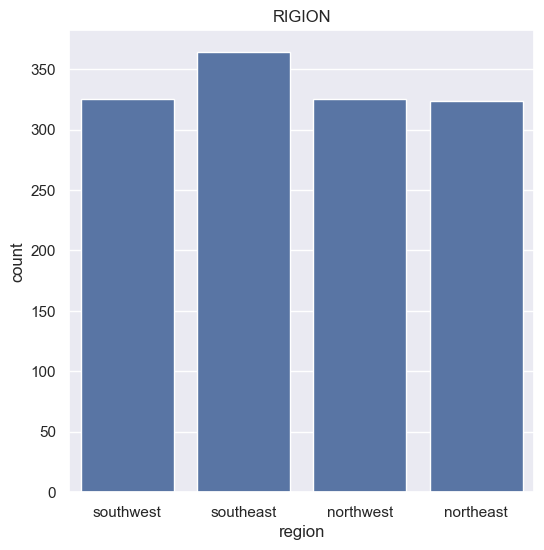

```python
import numpy as np
import pandas as pd
import matplotlib.pyplot as plt
import seaborn as sns
from sklearn.model_selection import train_test_split
from sklearn.linear_model import LinearRegression
from sklearn import metrics
```

## DATA COLLECTION & ANALYSIS


```python
# LODING THE DATA FROM csv FILE TO PANDAS DATAFRAME

insurance_dataset = pd.read_csv("insurance.csv")
```


```python
# top 5 rows of dataframe
insurance_dataset.head()
```


<div>
<style scoped>
    .dataframe tbody tr th:only-of-type {
        vertical-align: middle;
    }

    .dataframe tbody tr th {
        vertical-align: top;
    }

    .dataframe thead th {
        text-align: right;
    }
</style>
<table border="1" class="dataframe">
  <thead>
    <tr style="text-align: right;">
      <th></th>
      <th>age</th>
      <th>sex</th>
      <th>bmi</th>
      <th>children</th>
      <th>smoker</th>
      <th>region</th>
      <th>charges</th>
    </tr>
  </thead>
  <tbody>
    <tr>
      <th>0</th>
      <td>19</td>
      <td>female</td>
      <td>27.900</td>
      <td>0</td>
      <td>yes</td>
      <td>southwest</td>
      <td>16884.92400</td>
    </tr>
    <tr>
      <th>1</th>
      <td>18</td>
      <td>male</td>
      <td>33.770</td>
      <td>1</td>
      <td>no</td>
      <td>southeast</td>
      <td>1725.55230</td>
    </tr>
    <tr>
      <th>2</th>
      <td>28</td>
      <td>male</td>
      <td>33.000</td>
      <td>3</td>
      <td>no</td>
      <td>southeast</td>
      <td>4449.46200</td>
    </tr>
    <tr>
      <th>3</th>
      <td>33</td>
      <td>male</td>
      <td>22.705</td>
      <td>0</td>
      <td>no</td>
      <td>northwest</td>
      <td>21984.47061</td>
    </tr>
    <tr>
      <th>4</th>
      <td>32</td>
      <td>male</td>
      <td>28.880</td>
      <td>0</td>
      <td>no</td>
      <td>northwest</td>
      <td>3866.85520</td>
    </tr>
  </tbody>
</table>
</div>


```python
# number of rows & columns
insurance_dataset.shape
```


    (1338, 7)


```python
# getting some  information about the dataset
insurance_dataset.info()
```

    <class 'pandas.core.frame.DataFrame'>
    RangeIndex: 1338 entries, 0 to 1337
    Data columns (total 7 columns):
     #   Column    Non-Null Count  Dtype  
    ---  ------    --------------  -----  
     0   age       1338 non-null   int64  
     1   sex       1338 non-null   object 
     2   bmi       1338 non-null   float64
     3   children  1338 non-null   int64  
     4   smoker    1338 non-null   object 
     5   region    1338 non-null   object 
     6   charges   1338 non-null   float64
    dtypes: float64(2), int64(2), object(3)
    memory usage: 73.3+ KB
    

## CATEGORICAL FEATURES:
- SEX
- SMOKER
- REGION

# CHECKING FOR MISSING VALUES


```python
insurance_dataset.isnull().sum()
```


    age         0
    sex         0
    bmi         0
    children    0
    smoker      0
    region      0
    charges     0
    dtype: int64


## DATA ANALYSIS

#STATISTICAL MASURES OF THE DATASET


```python
insurance_dataset.describe()
```

#distribution of age values


```python
sns.set()
plt.figure(figsize=(6,6))
sns.histplot(insurance_dataset['age'],kde=True)
plt.title('AGE DISTRIBUTION')
plt.show()
```


    

    


#GENDER COLUMN


```python
plt.figure(figsize=(6,6))
sns.countplot(x='sex', data=insurance_dataset)
plt.title('SEX DISTRIBUTION')
plt.show()
```


    

    


```python
insurance_dataset['sex'].value_counts()
```


    sex
    male      676
    female    662
    Name: count, dtype: int64


#BMI DISTRIBUTION


```python
plt.figure(figsize=(6,6))
sns.distplot(insurance_dataset['bmi'])
plt.title('BMI DISTRIBUTION')
plt.show()
```

    
    
      sns.distplot(insurance_dataset['bmi'])
    


    

    


- NORMAL BMI RANGE --> 18.5 TO 24.9

#CHILDREN COLUMN


```python
plt.figure(figsize=(6,6))
sns.countplot(x='children',data=insurance_dataset)
plt.title('CHILDREN')
plt.show()
```


    

    


```python
insurance_dataset['children'].value_counts()
```


    children
    0    574
    1    324
    2    240
    3    157
    4     25
    5     18
    Name: count, dtype: int64


#SMOKER COLUMN


```python
plt.figure(figsize=(6,6))
sns.countplot(x='smoker',data=insurance_dataset)
plt.title('SMOKER')
plt.show()
```


    

    


```python
insurance_dataset['smoker'].value_counts()
```


    smoker
    no     1064
    yes     274
    Name: count, dtype: int64


#REGION COLUMN


```python
plt.figure(figsize=(6,6))
sns.countplot(x='region', data=insurance_dataset)
plt.title('RIGION')
plt.show()
```


    

    


```python
insurance_dataset['region'].value_counts()
```


    region
    southeast    364
    southwest    325
    northwest    325
    northeast    324
    Name: count, dtype: int64


#DISTRIBUTION OF CHARGES VALUES


```python
plt.figure(figsize=(6,6))
sns.distplot(insurance_dataset['charges'])
plt.title('CHARGES DISTRIBUTION')
plt.show()
```

    
    


    

    


## DATA PRE-PROCESSING

#ENCODING THE CATEGORICAL FEATURES


```python
pd.set_option('future.no_silent_downcasting', True)

# ENCODING SEX COLUMN
insurance_dataset.replace({'sex':{'male':0, 'female':1}},inplace = True)

# ENCODING SMOKER COLUMN
insurance_dataset.replace({'smoker':{'yes':0,'no':1}}, inplace = True)

# ENCODING REGION COLUMN
insurance_dataset.replace({'region':{'southeast':0, 'southwest':1, 'northeast':2, 'northwest':3}}, inplace = True)
```


```python
x = insurance_dataset.drop(columns='charges', axis=1)
y = insurance_dataset['charges']
```


```python
print(x)
```

          age  sex     bmi  children  smoker region
    0      19    1  27.900         0       0      1
    1      18    0  33.770         1       1      0
    2      28    0  33.000         3       1      0
    3      33    0  22.705         0       1      3
    4      32    0  28.880         0       1      3
    ...   ...  ...     ...       ...     ...    ...
    1333   50    0  30.970         3       1      3
    1334   18    1  31.920         0       1      2
    1335   18    1  36.850         0       1      0
    1336   21    1  25.800         0       1      1
    1337   61    1  29.070         0       0      3
    
    [1338 rows x 6 columns]
    


```python
print(y)
```

    0       16884.92400
    1        1725.55230
    2        4449.46200
    3       21984.47061
    4        3866.85520
               ...     
    1333    10600.54830
    1334     2205.98080
    1335     1629.83350
    1336     2007.94500
    1337    29141.36030
    Name: charges, Length: 1338, dtype: float64
    

#SPLITTING THE DATA INTO TRAINING DATA & TESTING DATA


```python
x_train, x_test, y_train, y_test = train_test_split(x, y, test_size = 0.2, random_state = 2)
```


```python
print(x.shape,x_train.shape,x_test.shape)
```

    (1338, 6) (1070, 6) (268, 6)
    

# MODEL TRAINING

#LINEAR REGRESSION


```python
# LOADING THE LINEAR REGRESSION MODEL
regressor = LinearRegression()
```


```python
regressor.fit(x_train, y_train)
```


#MODEL EVALUATION


```python
#PRADICTION ON TRAINING DATA
training_data_pradiction = regressor.predict(x_train)
```


```python
# r squared value
r2_train = metrics.r2_score(y_train, training_data_pradiction)
print(' r squared value : ',r2_train) 
```

     r squared value :  0.751505643411174
    

#BUILDING A PREDICTIVE SYSTEM


```python
input_data=(55,1,26.98,0,1,3)

#changing import data to a numpy array
input_data_as_numpy_array = np.asarray(input_data)

#reshap the array
input_data_reshaped = input_data_as_numpy_array.reshape(1,-1)

predicition = regressor.predict(input_data_reshaped)
print(predicition)

print('The Insurance cost is USD',predicition[0])


```

    [10840.47228611]
    The Insurance cost is USD 10840.472286111117
    

    C:\Users\DELL\AppData\Local\Programs\Python\Python312\Lib\site-packages\sklearn\utils\validation.py:2739: UserWarning: X does not have valid feature names, but LinearRegression was fitted with feature names
      warnings.warn(
    


```python

```
